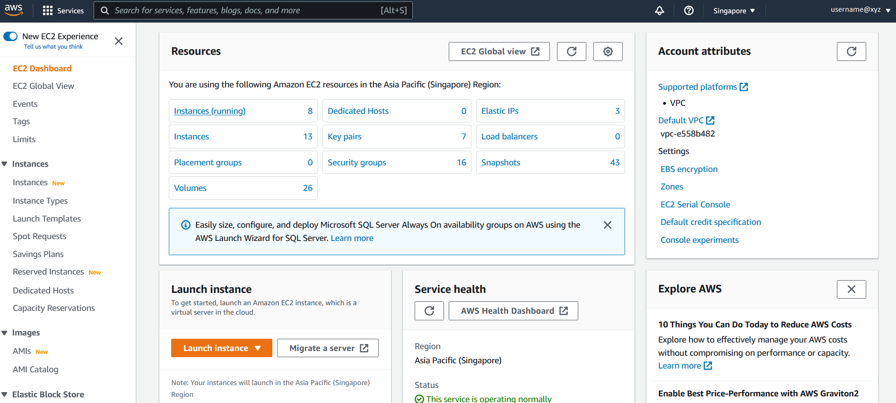
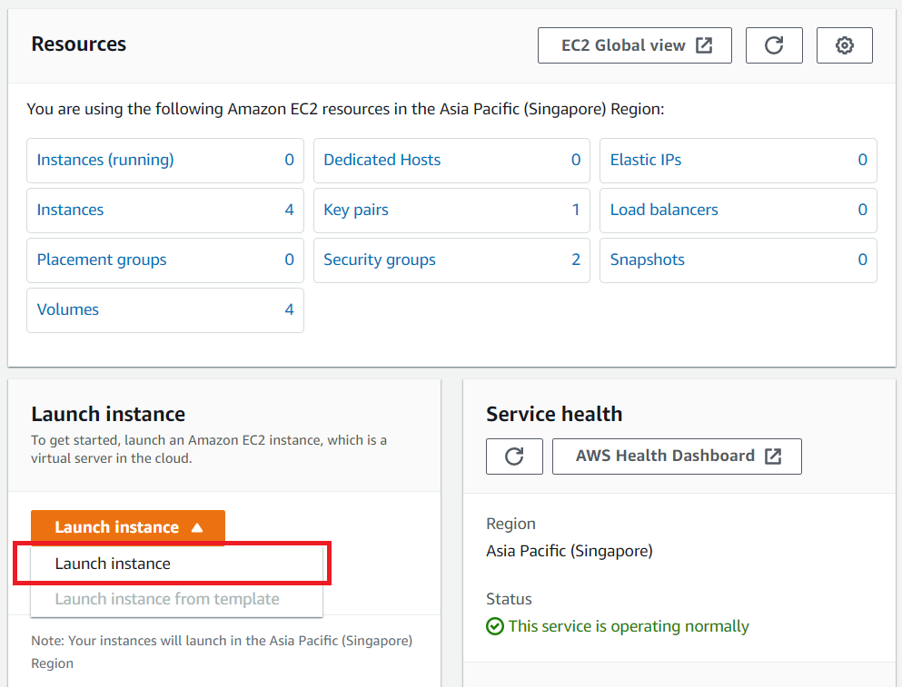

# II. START A VIRTUAL LINUX MACHINE

[LINK TO BACK TO ALL WORKSHOPS](./workshop.md)

# A. SIGN IN TO AWS CONSOLE (VIA EVENT ENGINE)
Your instructor will provide you with a special team hash login. Click the team hash login link. An email address will be requested for an OTP. This will help you access your temporary AWS account. When your sign in is successful, you will be taken to the Team Dashboard.


Next, click on the AWS Console button.

> Note the following:
The region that is specified in red will be the location of all your resources, and is the default region for this exercise.
The credentials seen in the box titled Credentials / CLI Snippets. This will be important later when configuring your machine. Depending on your OS, click the correct tab and note the contents.


If you ever need to access the Team Dashboard again during this training, click on the team hash login link again.

When ready, click Open AWS Console.

---

# B. LAUNCH THE EC2 DASHBOARD
1. In the AWS Management Console search bar, type EC2.


2. Choose EC2 to open the EC2 Dashboard.
Instances may be launched via a graphical user interface (the console) or with command line scripts. We’ll start with the graphical console interface first, known as the EC2 Dashbord.

Spend a few minutes familiarizing yourself with the layout of the dashboard:
- Left Navigation pane: Tools and features, such as the saved Amazon Machine Images (AMIs), storage volumes, and ssh keys.
- Center: Resource listings and the ability to launch an instance.
- Right pane: General information, such as documentation and pricing.



---

# C. CREATE A NEW KEY PAIR

In this section of the lab you will create a Linux instance and login to it to run a few Linux commands. To log in to an instance, you need to be able to connect via SSH. There are several layers of security for accessing instances that are enabled by default by AWS. One of these is with an SSH key pair, which can (very roughly) be thought of as like a unique username and password.

The following steps outline how to create a new SSH key pair that then you will use to log in to a new Linux instance.

1. Sign into the AWS Management Console and open the Amazon EC2 console at https://console.aws.amazon.com/ec2

2. In the upper-right corner of the AWS Management Console, confirm you are in the desired AWS region (e.g., Sydney).


3. In the left navigation pane click on Key Pairs under the Network & Security section. This will display a page to manage your SSH key pairs.


4. On the Key Pairs page click the Create Key Pair button at the top of the browser window.


5. In the resulting pop up window, provide a key pair name of your choosing and select .ppk or .pem depending on which ssh client you will use to connect to the EC2 Instance (For PuTTY select .ppk. For Windows Subsystem Linux, MacOS-X ssh Client, Linux ssh client, Windows ssh client select .pem).

> NOTE: For the purpose of this workshop please provide a unique key pair name, so that it might not clash with key pair names provided by other participants using the same AWS account. You could use your name initials in the key pair for easy identification.


6. Click add tag. We’ll get into this later, but tagging is an efficient way to track your resources in AWS. We’ll add two tags to this resource- the user (enter your initials) and an imaginary grant (enter a number, but be consistent). Click on Create key pair.


7. The key pair you created should automatically download to your system. Follow any browser instructions to save the file to the default download location. Verify that the file has downloaded and you can locate it. Remember the full path to this .ppk/pem file you just downloaded. This file contains your private key for future SSH connections.

8. You will see a message appear at the top of the screen that says Successfully created key pair. You will see the key pair you created listed.

# D. LAUNCH AN EC2 INSTANCE

We will now launch an EC2 Linux based instance.

Return to the AWS Management Console and open the Amazon EC2 Dashboard.

1. In the upper-right corner of the AWS Management Console, confirm you are in the desired AWS region (e.g., Sydney).


2. Click Launch instance, then click Launch instance again from the drop down menu.



3. On the Launch an instance page, you can choose a friendly name for your instance.


4. Click on “Add additional tags” and “Add Tag”. You will find the “Name” you provided for your instance. Now enter the key and value. These keys, more correctly known as a tags, will appear in the console once the instance launches. It makes it easy to keep track of running machines in a complex environment. Create additional tags similar for the ones you used for the key pair previously - give a user and grant key to this machine, and enter the same values. When ready, select Instances, Volumes, Network interfaces under the Resource types.


5. Now select the first Amazon Linux 2 AMI(HVM), SSD Volume Type and check 64-bit (x86) under the Architecture drop-down list.
> NOTE: The ami-xxxxxxxxx label and specific versions of the installed package may be different than in the image below.


6. Under Instance type, click on the drop-down arrow and type c5.2xlarge into the search bar.
> Note: This is a somewhat large instance; in general, you should pick these instances based on an analysis of how much RAM and CPU you will need for your job / analysis.


7. Select the key pair that you created in the beginning of this lab from the drop-down list under Key pair (login).


8. Next click on Edit against Network settings. You will be prompted to provide Subnet and Security group details. The security groups will be your firewall rules.
    -  Note that the Subnet field can be configured to launch the instance in a specific Availability Zone; while we are keeping the default for this workshop, this gives you control over the location of your machine.
    - Provide a name for your new security group. NOTE: For the purpose of this lab use your “[Your initials]-sec-group”.
    - Confirm an existing SSH rule exists which allows TCP port 22.
    - To accept connections from anywhere, select the drop-down box under the Source type column and select Anywhere which will correspond to 0.0.0.0/0.


9. Under Configure storage, you have the ability to modify or add storage and disk drives to the instance. For this lab, we will simply accept the storage defaults.


10. Review your configuration under Summary and click Launch Instance.


11. Your instance will now start, which may take a moment. You will be shown the Launch Status page with the message Successfully initiated launch of instance.

12. On the lower right of the page click on View all Instances to view the list of EC2 instances. Click on your instance. It will go through an initialization process. Once your instance has launched, you will see your Linux server as well as the Availability Zone the instance is in, and the publicly routable DNS name.


# E. SSH INTO AN EC2 INSTANCE

The operating system of your local computer determines the options that you have to connect from your local computer to your Linux instance. Here are directions to connect from Windows Using PuTTY or OpenSSH, From Linux & MacOS-X using ssh client and from Windows Subsystem for Linux (WSL) using ssh client.

> Note: The AMI used is that of an Amazon Linux machine, so your username will be “ec2-user”

---

Connecting from Windows using PuTTY

---

We will now use the private .ppk file of the key pair generated earlier to open a SSH session to the EC2 instance.

1. Start the PuTTY application.

2. Enter in the IP address of the EC2 instance in the Host Name (or IP address) field.

3. To save the session (so we dont have to repeat the configuration everytime) provide a name in the Saved Sessions field.

4. In the left navigation pane under Connections click on SSH and next click on Auth.

5. In the Private key file for authentication field click Browse and browse in the .ppk file downloaded when creating the key pair earlier.

6. Next in the left navigation pane click on Session (scroll up if you need to) and and further click on Save to save the session.

7. Next click on Open to start the SSH session.

8. PuTTy will now attempt to start an SSH Session.

> NOTE: You will get a security alert The Servers host key is not cached in the registry, click on Yes to continue.

9. You will now be presented with the login as prompt.

10. At the login as prompt type ec2-user and hit enter.

> NOTE: Username to be used here is ec2-user if your image is Amazon Linux OS and ubuntu if your image is Ubuntu Linux OS.

You would have now logged into the EC2 instance on AWS.

---

Connecting from Windows using MobaXterm

---

We will use the private .pem key pair to open an SSH session to the EC2 instance.

1. Start the MobaXterm application.

2. To open a session, click on Session in the top-left corner, then click SSH.

3. Enter in the IP address of the EC2 instance in the Host Name field.

4. To the right, select username and enter your username for the session.

> NOTE: Username to be used here is ec2-user if your image is Amazon Linux OS and ubuntu if your image is Ubuntu Linux OS.

5. Below, click on Advanced Settings, and select private key (use your .pem file).

Click Ok.

6. MobaXterm will have logged you in to your EC2 instance.

---

Connecting from Windows using Windows Subsystem for Linux

---

We will now use the private .pem file of the key pair generated earlier to open a SSH session to the EC2 instance.

1. Copy the private key from Windows to WSL - In a WSL terminal window, copy the .pem file (for the key pair that you specified when you launched the instance) from Windows to WSL. Note the fully-qualified path to the .pem file on WSL to use when connecting to your instance.

```
cp /mnt/<Windows drive letter>/path/my-key-pair.pem ~/WSL-path/my-key-pair.pem
```

2. In a terminal window, use the ssh command to connect to the instance. Specify the path and file name of the private key (.pem), the user name for your instance, and the public DNS name or IP Address.

NOTE: Username to be used here is ec2-user if your image is Amazon Linux OS and ubuntu if your image is Ubuntu Linux OS.

```
sudo ssh -i /path/my-key-pair.pem ec2-user@<ip-address>
```

You will see the following response:

```
The authenticity of host '<ip-address>'
can't be established.
RSA key fingerprint is 1f:51:ae:28:bf:89:e9:d8:1f:25:5d:37:2d:7d:b8:ca:9f:f5:f1:6f.
Are you sure you want to continue connecting (yes/no)?
```

3. Enter Yes

you will now be logged into the EC2 Instance.

---

Connecting using SSH on Linux & MacOS and OpenSSH on Windows

---

We will now use the private .pem file of the key pair generated earlier to open a SSH session to the EC2 instance.

1. In a terminal window, use the ssh command to connect to the instance. Specify the path and file name of the private key (.pem), the user name for your instance, and the public DNS name or IP Address of your instance.
NOTE: Username to be used here is ec2-user if your image is Amazon Linux OS and ubuntu if your image is Ubuntu Linux OS.

```
ssh -i /path/my-key-pair.pem ec2-user@<ip-address>
```

You see a response like the following:

```
The authenticity of host 'ec2-198-51-100-1.compute-1.amazonaws.com (198-51-100-1)' can't be established.
ECDSA key fingerprint is l4UB/neBad9tvkgJf1QZWxheQmR59WgrgzEimCG6kZY.
Are you sure you want to continue connecting (yes/no)?
```

2. Enter Yes

You will now be logged into the Instance.

> NOTE: You might need to change the permissions of the key file by running the chmod command as follows

```
chmod 600 /path/my-key-pair.pem
```

For detailed directions on these please have a look at the following links:

PuTTY, Windows Susbsystem for Linux, MacOS-X ssh Client, Linux ssh client

# F. RUN LINUX COMMANDS

Let us run a few Linux commands to install a few software packages. Enter the following commands, and press y and enter when necessary. The instance that we have started is completely blank and does not contain any downloaded programs or software. We will need to build it up from scratch.

From yum (nmap): just to install a network tool

```
sudo yum install nmap
```

From source (seqtk):

```
sudo su -
```
```
yum install git
```
```
cd /usr/local/src
```
```
git clone https://github.com/lh3/seqtk.git
```
```
cd seqtk/
```
```
make
```
Whoops! That command failed. We’re still missing something. Now install gcc zlib-devel:
```
yum install gcc zlib-devel
```
```
make
```
Now the command should be recognized! There we go. Try seqtk again:
```
./seqtk
```
As you can see, the default “base” images are exactly that - clean initial installations of just the operating system. These are perfect for customizing so that you have exactly the software you might need - but some setup will be required. Another option is to use an AMI (Amazon Machine Image) that already has some software installed. We’ve made our lab’s AMI, which has quite a bit of genomics sofware pre-installed, available for all to use. We’ll do this in the next section.

# G. STOP AND TERMINATE INSTANCE

Now let us stop and terminate the instance - before following these steps, listen to your instructor. For educational purposes, they may ask you to review the steps, but not actually terminate the instance.

1. Return to the AWS console. In the AWS Management Console search bar, type “EC2”, or click the EC2 Dashboard item in the left-hand menu.

2. Choose EC2 to open the EC2 Dashboard.

3. Click on Instances under the Instances section in the left navigation pane to view all the instances that are Running, Stopped and Terminated.

4. Select the instance created and click on Instance State, then Stop instance.


5. Click on Stop to confirm stopping the instance.


The instance will now attempt to stop, wait for a few moments for the instance to stop, until Instance State column shows Stopped.

We will now terminate the EC2 instance.

Select the EC2 instance from the list of instances. Click on Instance State, and then click on Terminate instance.


In the Terminate Instance dialog, observe the note On an EBS-backed instance, the default action is for the root EBS volume to be deleted when the instance in terminated. Storage on any local drives will be lost. To proceed, select Terminate.


The instance will now be terminated.

After a few minutes, the Instance State of the instance will update to show that it’s Terminated.

[LINK TO BACK TO ALL WORKSHOPS](./workshop.md)