# III. START A LINUX MACHINE FROM A SHARED AMI

[LINK TO BACK TO ALL WORKSHOPS](./workshop.md)

# A. LAUNCH THE EC2 DASHBOARD
1. In the AWS Management Console search bar, type EC2.

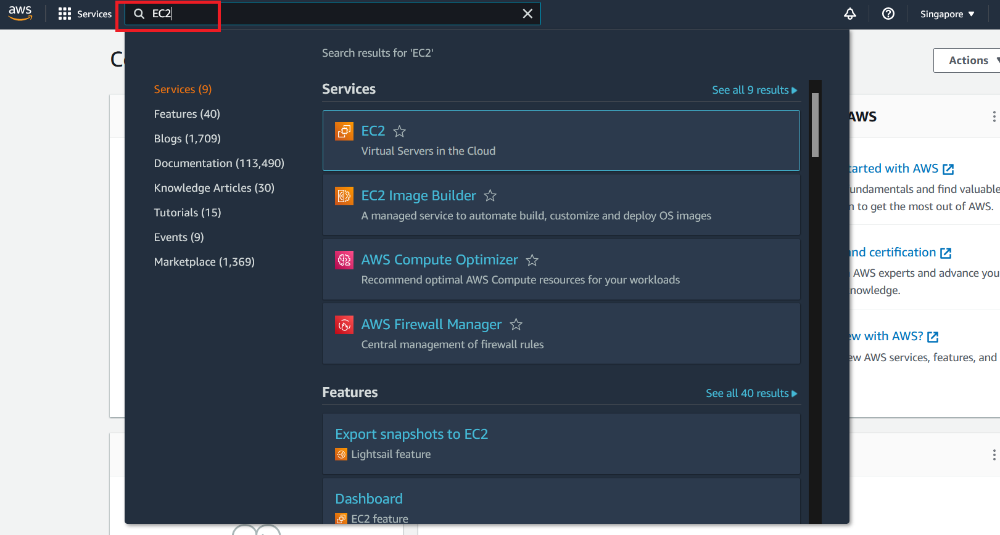

2. Choose EC2 to open the EC2 Dashboard.

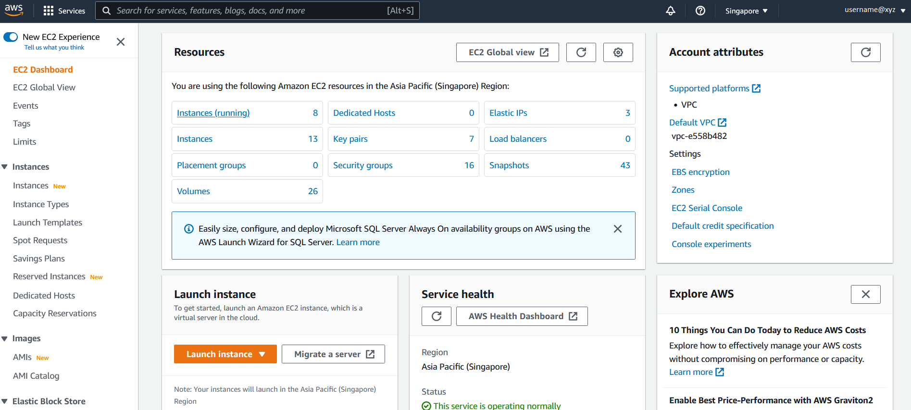

# B. LAUNCH AN EC2 INSTANCE
We will now launch an EC2 Linux-based instance.

1. Click on Launch Instance, then click Launch instance again from the drop down menu.

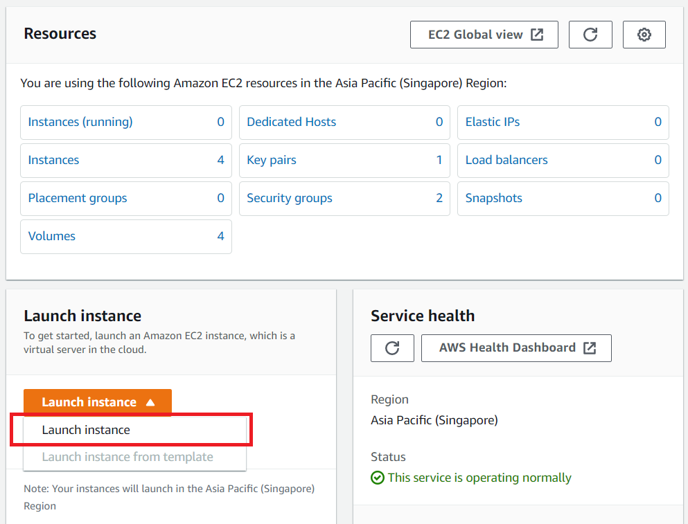

2. On the Launch an instance page, you can choose a friendly name for your instance.

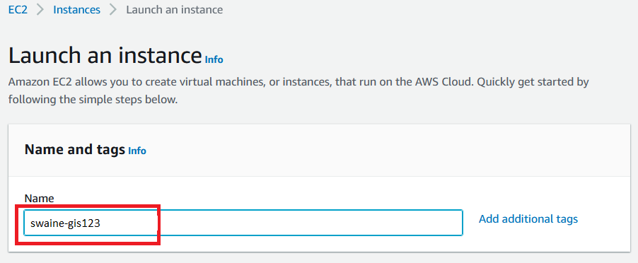

3. Click on Add additional tags and “Add Tag”. You will find the “Name” you provided for your instance. Now enter the key and value. These keys, more correctly known as a tags, will appear in the console once the instance launches. It makes it easy to keep track of running machines in a complex environment. Create additional tags similar for the ones you used for the key pair previously - give a user and grant key to this machine, and enter the same values. When ready, select Instances, Volumes, Network interfaces under the Resource types.

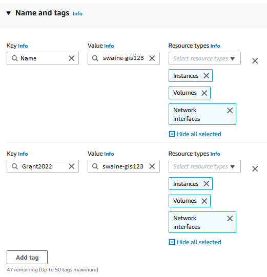

4. Under Application and OS images (Amazon Machine Image) enter the AMI ID shared for the training into the search box. The AMI may differ from the one pictured; refer to instructor’s directions.
> Note: For this training, search for CHENLAB-PUBLIC and choose the most recent AMI version; as of September, 2022 this is v2.10b, which has ID ami-0bf420c98bedabe91. You can find out more about CHENLAB-PUBLIC AMIs in Appendix: About the AMI.

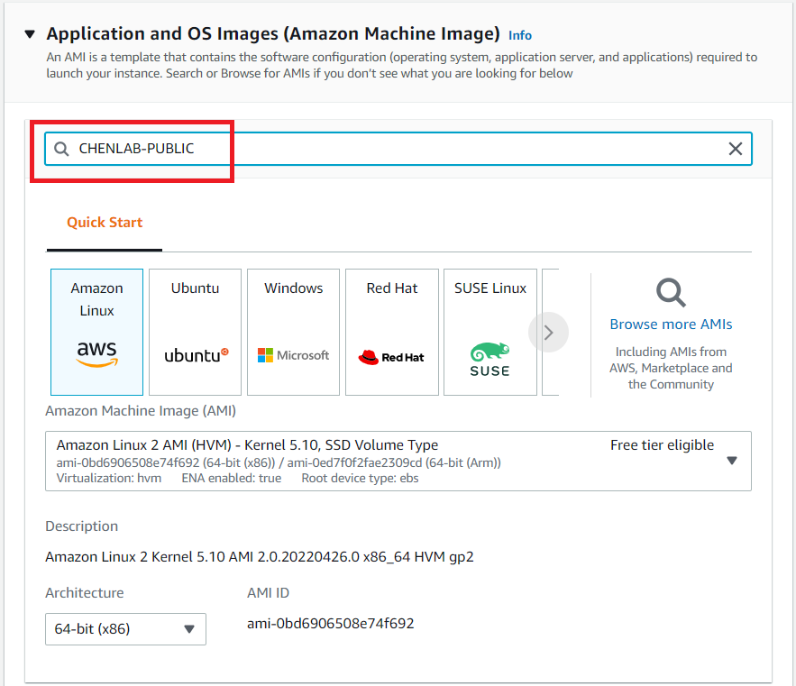

6. The results of the search appear in Community AMIs and in AWS Marketplace.

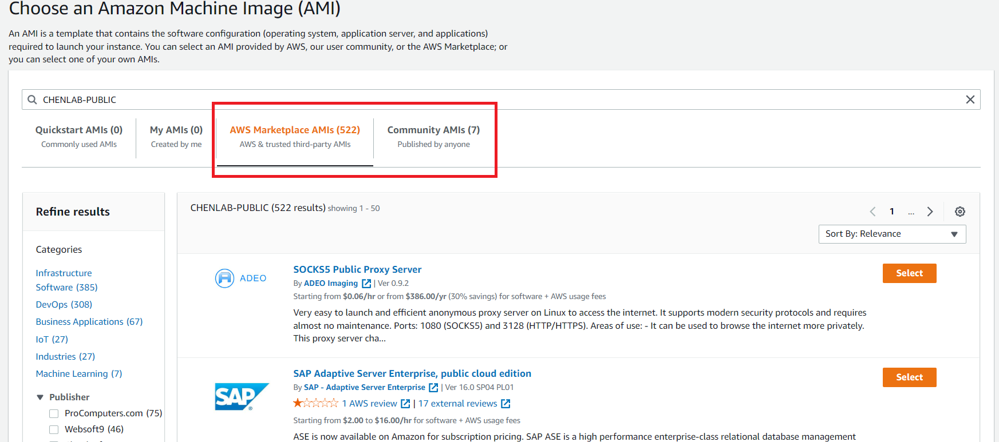

7. Click on the results in Community AMIs.
The AMI ID will now appear.

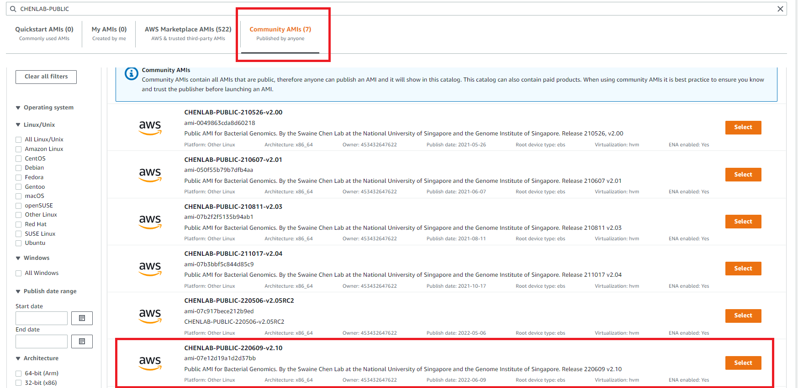

8. Click on the Select button to select the AMI. Be sure to select the lastest version of the AMI (see above, Step 4. Note).

Under Instance type, click on the drop-down arrow and type c5.large into the search bar.

> Note: The choice of instance type should be based on the amount of CPU and RAM that you will need for your job or analysis.

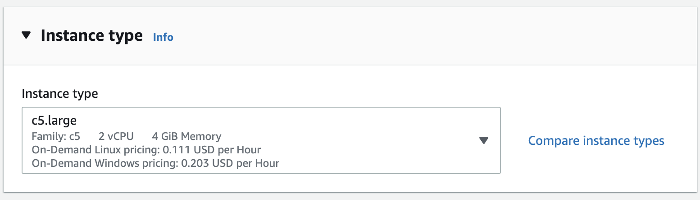

9. Select the key pair that you created in the beginning of this lab from the drop-down list under Key pair (login).


10. Next click on Edit against Network settings. You will be prompted to provide Subnet and Security group details. The security groups will be your firewall rules.
    - Note that the Subnet field can be configured to launch the instance in a specific Availability Zone; while we are keeping the default for this workshop, this gives you control over the location of your machine.
    - Provide a name for your new security group. NOTE: For the purpose of this lab use your “[Your initials]-sec-group”.
    - Confirm an existing SSH rule exists which allows TCP port 22.
    - To accept connections from anywhere, select the drop-down box under the Source type column and select Anywhere which will correspond to 0.0.0.0/0.

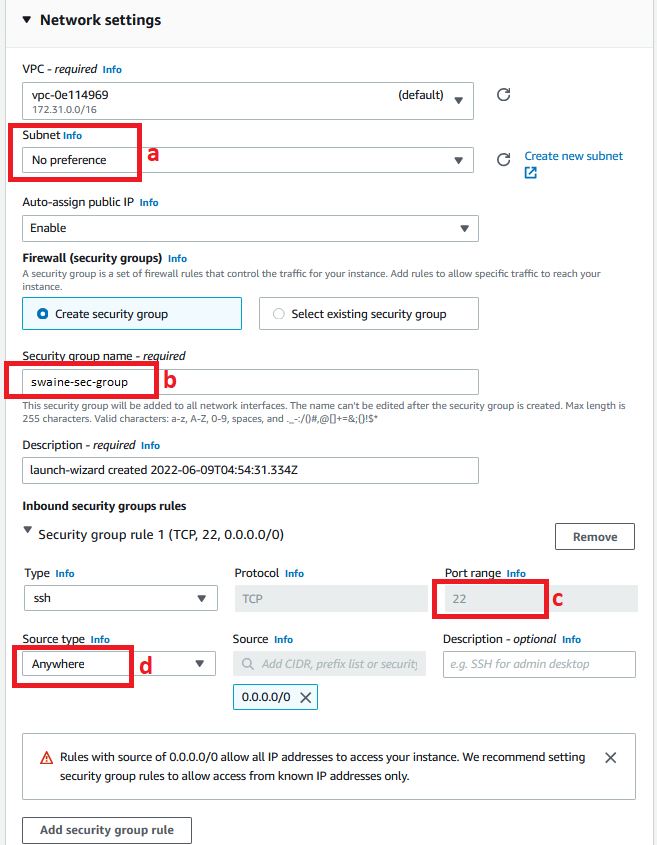

11. Under Configure storage, you have the ability to modify or add storage and disk drives to the instance. For this lab, we will simply accept the storage defaults.

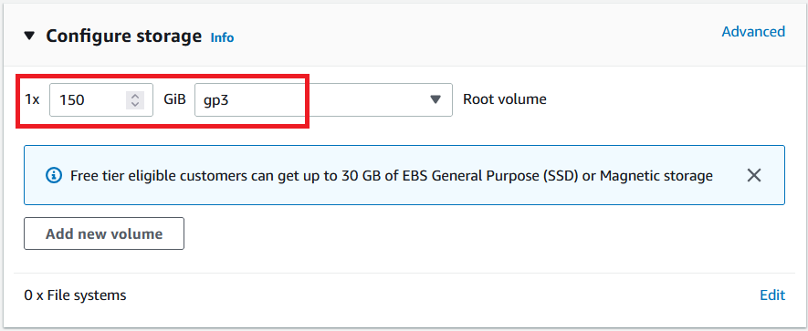

12. Review your configuration under Summary and click Launch Instance.

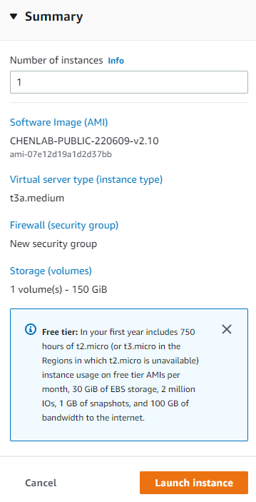

13. Your instance will now start, which may take a moment. You will be shown the Launch Status page with the message Successfully initiated launch of instance.

14. On the lower right of the page click on View all Instances to view the list of EC2 instances. Click on your instance. It will go through an initialization process. Once your instance has launched, you will see your Linux server as well as the Availability Zone the instance is in, and the publicly routable DNS name.

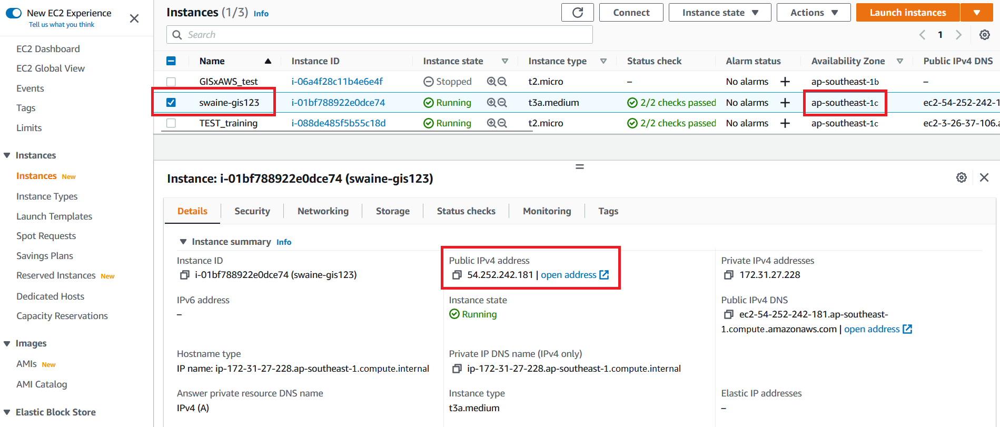

# C. SSH INTO AN EC2 INSTANCE

The operating system of your local computer determines the options that you have to connect from your local computer to your Linux instance. Here are directions to connect from Windows Using PuTTY or OpenSSH, From Linux & MacOS-X using ssh client and from Windows Subsystem for Linux (WSL) using ssh client.

> Note: The AMI used is that of an Amazon Linux machine, so your username will be “ec2-user”

---

Connecting from Windows using PuTTY

---

We will now use the private .ppk file of the key pair generated earlier to open a SSH session to the EC2 instance.

1. Start the PuTTY application.

2. Enter in the IP address of the EC2 instance in the Host Name (or IP address) field.

3. To save the session (so we dont have to repeat the configuration everytime) provide a name in the Saved Sessions field.

4. In the left navigation pane under Connections click on SSH and next click on Auth.

5. In the Private key file for authentication field click Browse and browse in the .ppk file downloaded when creating the key pair earlier.

6. Next in the left navigation pane click on Session (scroll up if you need to) and and further click on Save to save the session.

7. Next click on Open to start the SSH session.

8. PuTTy will now attempt to start an SSH Session.

> NOTE: You will get a security alert The Servers host key is not cached in the registry, click on Yes to continue.

9. You will now be presented with the login as prompt.

10. At the login as prompt type ec2-user and hit enter.

> NOTE: Username to be used here is ec2-user if your image is Amazon Linux OS and ubuntu if your image is Ubuntu Linux OS.

You would have now logged into the EC2 instance on AWS.

---

Connecting from Windows using MobaXterm

---

We will use the private .pem key pair to open an SSH session to the EC2 instance.

1. Start the MobaXterm application.

2. To open a session, click on Session in the top-left corner, then click SSH.

3. Enter in the IP address of the EC2 instance in the Host Name field.

4. To the right, select username and enter your username for the session.

> NOTE: Username to be used here is ec2-user if your image is Amazon Linux OS and ubuntu if your image is Ubuntu Linux OS.

5. Below, click on Advanced Settings, and select private key (use your .pem file).

Click Ok.

6. MobaXterm will have logged you in to your EC2 instance.

---

Connecting from Windows using Windows Subsystem for Linux

---

We will now use the private .pem file of the key pair generated earlier to open a SSH session to the EC2 instance.

1. Copy the private key from Windows to WSL - In a WSL terminal window, copy the .pem file (for the key pair that you specified when you launched the instance) from Windows to WSL. Note the fully-qualified path to the .pem file on WSL to use when connecting to your instance.

```
cp /mnt/<Windows drive letter>/path/my-key-pair.pem ~/WSL-path/my-key-pair.pem
```

2. In a terminal window, use the ssh command to connect to the instance. Specify the path and file name of the private key (.pem), the user name for your instance, and the public DNS name or IP Address.

> NOTE: Username to be used here is ec2-user if your image is Amazon Linux OS and ubuntu if your image is Ubuntu Linux OS.

```
sudo ssh -i /path/my-key-pair.pem ec2-user@<ip-address>
```

You will see the following response:

```
The authenticity of host '<ip-address>'
can't be established.
RSA key fingerprint is 1f:51:ae:28:bf:89:e9:d8:1f:25:5d:37:2d:7d:b8:ca:9f:f5:f1:6f.
Are you sure you want to continue connecting (yes/no)?
```

3. Enter Yes

you will now be logged into the EC2 Instance.

---

Connecting using SSH on Linux & MacOS and OpenSSH on Windows

---

We will now use the private .pem file of the key pair generated earlier to open a SSH session to the EC2 instance.

1. In a terminal window, use the ssh command to connect to the instance. Specify the path and file name of the private key (.pem), the user name for your instance, and the public DNS name or IP Address of your instance.
> NOTE: Username to be used here is ec2-user if your image is Amazon Linux OS and ubuntu if your image is Ubuntu Linux OS.

```
ssh -i /path/my-key-pair.pem ec2-user@<ip-address>
```

You see a response like the following:

```
The authenticity of host 'ec2-198-51-100-1.compute-1.amazonaws.com (198-51-100-1)' can't be established.
ECDSA key fingerprint is l4UB/neBad9tvkgJf1QZWxheQmR59WgrgzEimCG6kZY.
Are you sure you want to continue connecting (yes/no)?
```

2. Enter Yes

You will now be logged into the Instance.

> NOTE: You might need to change the permissions of the key file by running the chmod command as follows

```
chmod 600 /path/my-key-pair.pem
```

For detailed directions on these please have a look at the following links:

PuTTY, Windows Susbsystem for Linux, MacOS-X ssh Client, Linux ssh client

[LINK TO BACK TO ALL WORKSHOPS](./workshop.md)