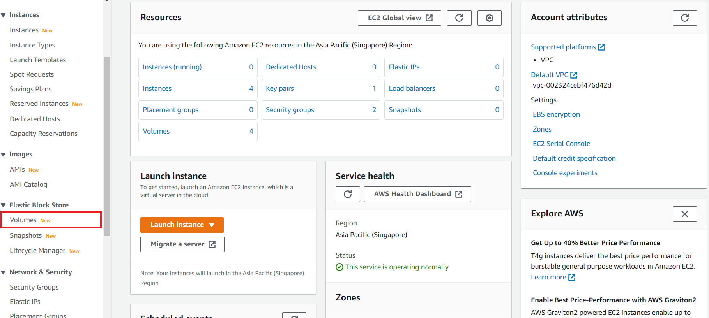
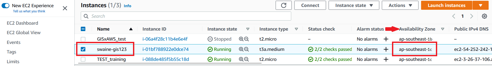
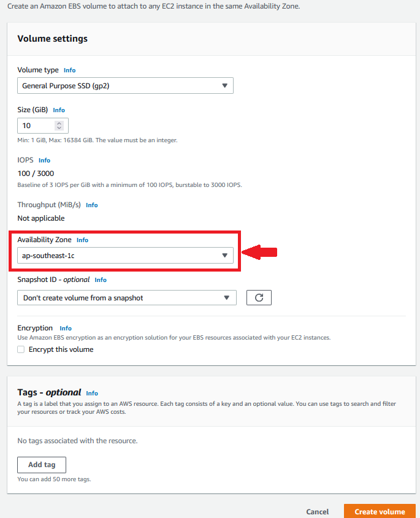
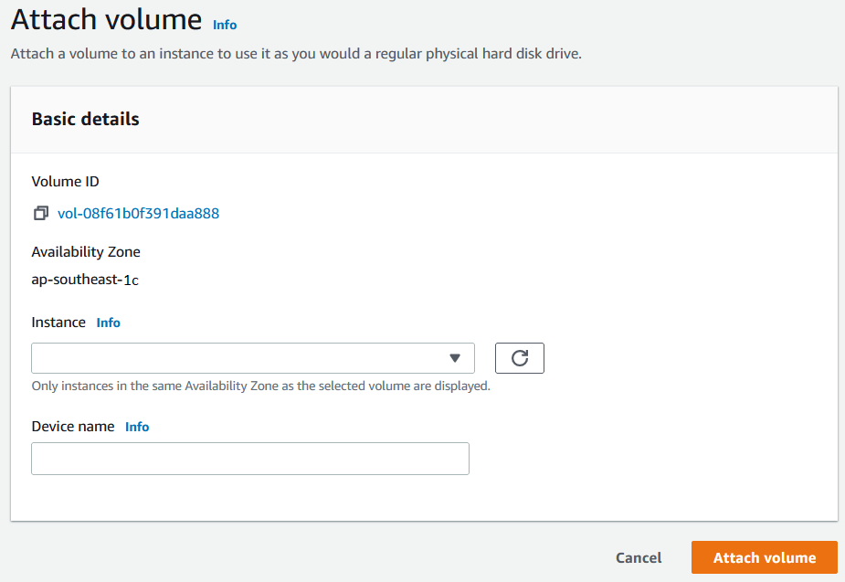
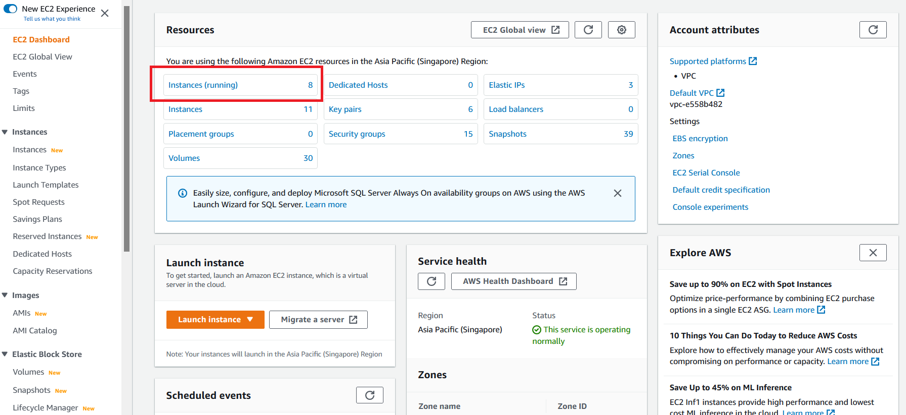

# IV. ATTACH ADDITIONAL STORAGE

[LINK TO BACK TO ALL WORKSHOPS](./workshop.md)

# A. CREATE AN EBS VOLUME

1. In the AWS Management Console search bar, type EC2 to navigate to the EC2 Service.

2. On the Left Navigation Bar click on Volumes under Elastic Block Store



3. Click on Create Volume (on the top right corner) to create a new volume

4. In the Create Volume page fill out the required size of the volume in GB, e.g. 10 GB or more depending on the data set size.

> NOTE: For the purposes of this lab 10 GB will suffice.

> Important: Make sure the Availability Zone is the same as the EC2 instance you are going to attach the volume to.





5. Click on Add Tag to uniquely tag the resource. Provide “Name” for the Key and “[your initials]-EBS” for the value.


6. Click on Create Volume to Create the volume.

# B. ATTACH AN EBS VOLUME TO A RUNNING INSTANCE
1. On the Left Navigation Bar click on Volumes under Elastic Block Store to view all the volumes. Select your newly created volume searching the list for the unique Name tag provided in the previous step.

2. Click on Actions and further click on Attach Volume

3. In the Attach Volume dialog, click on the Instance field and select the EC2 instance by looking for the Instance ID or Name Tag in the list. Click Attach to attach the volume.



4. If attached successfully - In the list of displayed volumes you should see your new volume having a status (under the State Column) indicating In Use.

5. On the left Navigation pane click EC2 Dashboard on the very top of the list of items.

5. Select Instances (running) and then select your EC2 Instance from the list of instances to which you attached the Volume.



6. In the EC2 Details section select Storage to see the Block devices attached to the instance. Notice the new volume just created attached as an additional Block Device with a Volume ID, Device Name and Volume Size.


> Important: Note down the specific device name for the next step of mounting the volume. The drive name may differ from what’s shown.

> NOTE: Depending on the Linux version and the machine type, the device names may differ. The EC2 Console will generally show /dev/sdX, where X is a lower-case letter, but you may see /dev/xvdX or /dev/nvmeYn1.

# C. MOUNT THE VOLUME
1. Log in to your EC2 Instance.

2. List the available disks using the following command:
```
lsblk
```
The output will list the disks attached to your instance.

> NOTE: Depending on the Linux version and the machine type, the device names may differ. The EC2 Console will generally show /dev/sdX, where X is a lower-case letter, but you may see /dev/xvdX or /dev/nvmeYn1. The following table may help with translating. Another way to help track is to pick different sizes for your EBS volumes (such as 151, 152, 153 GB for different volumes).

| Device name (Console)	| Alternate 1 | Alternate 2 |
| ----------- | ----------- | ----------- |
| /dev/sda|/dev/xvda|/dev/nvme0n1
| /dev/sdb|/dev/xvdb|/dev/nvme1n1
| /dev/sdc|/dev/xvdc|/dev/nvme2n1
| /dev/sdd|/dev/xvdd|/dev/nvme3n1
| /dev/sde|/dev/xvde|/dev/nvme4n1
| /dev/sdf|/dev/xvdf|/dev/nvme5n1

3. Check for an unmounted filesystem of size 10GB. For example: “nvme1n1” as shown below:
```
NAME        MAJ:MIN RM  SIZE RO TYPE MOUNTPOINT
nvme0n1     259:0    0  150G  0 disk
└─nvme0n1p1 259:1    0  150G  0 part /
nvme1n1     259:2    0   10G  0 disk
```
4. Check if the volume has any data using the following command:
```
sudo file -s /dev/nvme1n1
```
Where “nvme1n1” is the device you noted from the previous section after attaching the device to the EC2 Instance.

If the above command output shows "/dev/nvme1n1: data", it means your volume is empty.

5. Format the volume to the ext4 filesystem using the following command.

```
sudo mkfs -t ext4 /dev/nvme1n1
```

>NOTE: This file-system formatting step is only for a new device, DO NOT run this step while mounting an existing volume as it will wipe out all data on the device.

6. Create a directory of your choice to mount our new ext4 volume. Let’s use the name “volume1”.
```
sudo mkdir /mnt/volume1
```
7. Mount the volume to “volume1” directory using the following command.
```
sudo mount /dev/nvme1n1 /mnt/volume1
```
8. cd into the volume1 directory and check the disk space for confirming the volume mount.
```
cd /mnt/volume1
df -h .
```
The above command would show the free space in the volume1 directory.

9. At this point, the drive is owned by root and not user. We will want to change ownership of the drive, so that you can change the contents of the drive (Add/remove files, etc).
```
sudo chown -R ubuntu /mnt/volume1
```
10. For your own information, it is possible to later remove this device. Practice unmounting, then remounting it. To unmount the volume, you have to use the following command. Make sure to be outside the directory to unmount the volume.
```
sudo umount /dev/nvme1n1
```
But we’ll need this device for later, so remember to re-mount it.
```
sudo mount /dev/nvme1n1 /mnt/volume1
```

[LINK TO BACK TO ALL WORKSHOPS](./workshop.md)