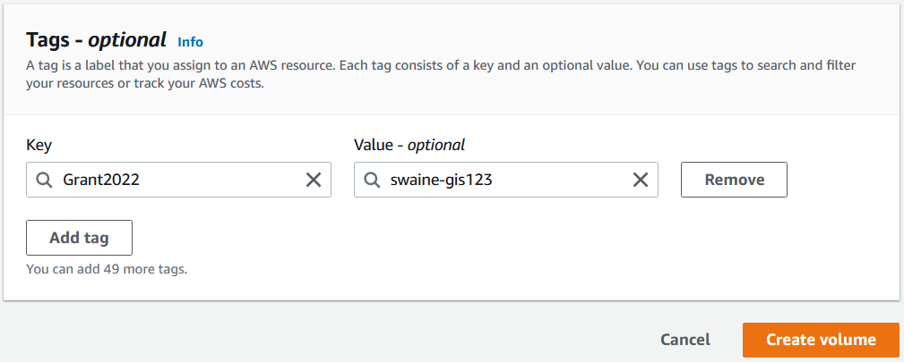

# V. AWS CLI

[LINK TO BACK TO ALL WORKSHOPS](./workshop.md)

# A. INTRODUCTION TO AWS CLI
The AWS CLI allows you to manage services using the command line and control services through scripts. Many users choose to conduct some level of automation using the AWS CLI.

Connect to an EC2 instance and paste the following command. AWS CLI is already installed on your machine, but this will initiate an update. There are a few ways to check this, depending on how it was installed

```
dpkg --list | grep awscli
pip3 list | grep awscli
```

Check Existing Amazon EC2 Instances

Use the following commands to explore AWS CLI (use q to exit windows):

- general AWS CLI help
- help related to Amazon EC2 commands
- the list of your existing instances with their key characteristics
- the list of your registered SSH key-pairs

```
aws help
```
```
aws ec2 help
```
```
aws ec2 describe-instances
```
```
aws ec2 describe-key-pairs
```

The above describe-instances and describe-key-pairs commands will likely fail because we did not set our AWS account’s credentials: the access keys and the region. This results in a permissions error as credentials are required to access AWS resources such as EC2, S3, and so on (without them AWS CLI does not know which account you are referring to). You can enter those manually using the aws configure command.

As we have not yet configured the instance with the AWS account’s credentials, the ~/.aws/ folder will not be available. Now let us go ahead with aws configure.

---

# B. AWS CONFIGURE - EVENT ENGINE

> Important: As you are using Event Engine for this workshop, you will be using the code snippet with the temporary account’s credentials from the Console page. This will be analogous to going through the manual setting up described next in points 1-4 under “AWS Configure - General Use”.

1. Copy the Credentials/CLI Snippet onto the command line.



2. Now rerun the ec2 describe-instances command again and check the output.
```
aws ec2 describe-instances
```
3. This gives a description of all the EC2 instances in the account for the specified region.

Let’s take a look at the key-pairs we have for the selected region.
```
aws ec2 describe-key-pairs
```
---

# B. VERIFYING AWS CREDENTIALS
Before we interact with the Amazon S3 let us take a look at the importance of the AWS credentials.

AWS security credentials are used to verify

1. Who you are
2. Your permission to access the resources that you are requesting
AWS uses these security credentials to authenticate and authorize your requests.

We configured who you are in the earlier section. Let us inspect out identity.
```
aws sts get-caller-identity
```
You role will be shown, press 'q' to exit.

> IMPORTANT: If you are using Event Engine for this workshop, make sure to have the AWS ACCESS KEY ID, AWS SECRET ACCESS KEY, AWS DEFAULT REGION match the temporary account’s credentials from the Console page on Event Engine. The AWS SESSION TOKEN is unique for each Event Engine session (this session token is NOT APPLICABLE for an original AWS account).

We now successfully configured who you are. Next, we will configure your permission to access the resources that you are requesting (i.e. with a “named profile”) to interact with Amazon S3.

[LINK TO BACK TO ALL WORKSHOPS](./workshop.md)